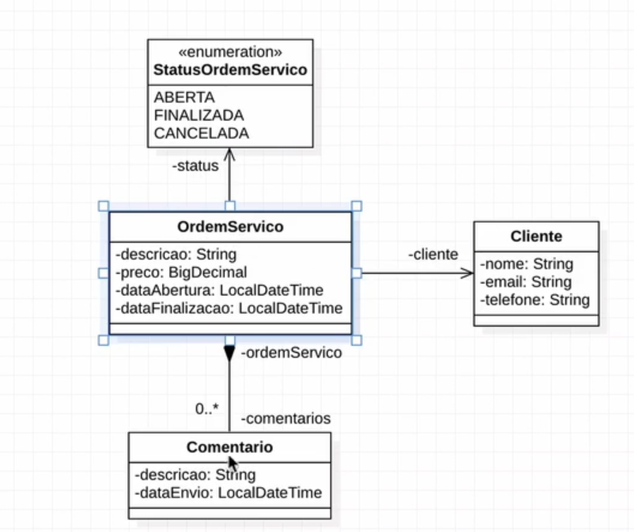

# Has Service Order

> Web API para ordens de serviço de determinado produto



## Tecnologias utilizadas

- ASP .NET 8.0
- SQL Server

## como criar o projeto

```shell
$ dotnet new sln -o has-service-order
$ dotnet new webapi -o HasServiceOrder.Api
$ dotnet sln add ./HasServiceOrder.Api/HasServiceOrder.Api.csproj
$ dotnet new xunit -o HasServiceOrder.Tests
$ dotnet sln add ./HasServiceOrder.Tests/HasServiceOrder.Tests.csproj
$ dotnet add ./HasServiceOrder.Api/OsDsII.Api.csproj reference ./HasServiceOrder.Tests/HasServiceOrder.Tests.csproj
```

## TODO

- [ ] Adicionar Xunit para testes unitários
- [ ] Adicionar InMemoryDatabase para testes de integração e e2e
- [ ] Adicionar workflow .net asp no github
- [ ] Adicionar Sonarqube para quality gates
- [ ] Adicionar padrões de projeto pós controllers criadas
- [ ] Adicionar EF para migrations e seeds
- [ ] Adicionar model mapper
- [ ] Documentar swagger openapi3.0
